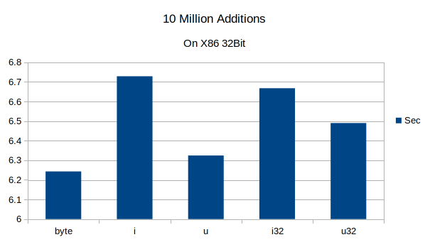
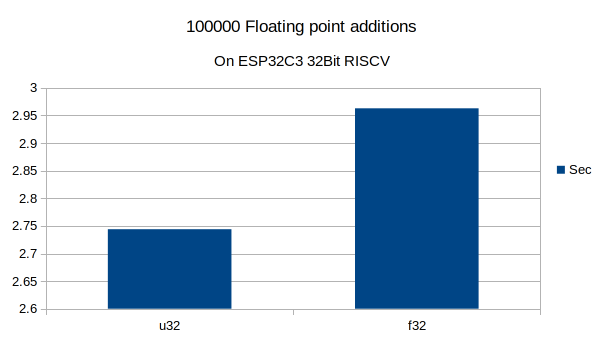
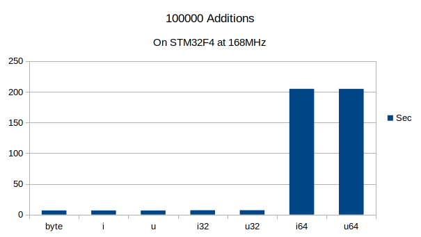
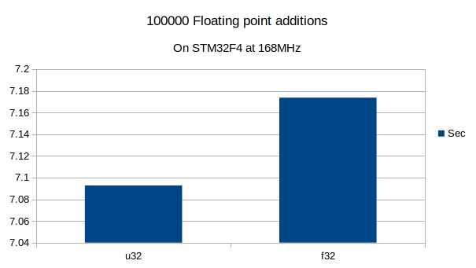
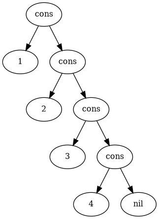
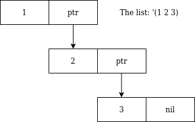
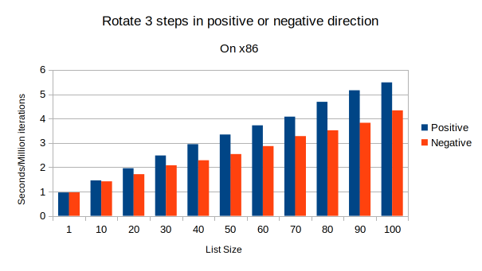

# LispBM Reference Manual

## About Symbols

Symbols are very important and central to LispBM and also perhaps a bit different from identifiers/names used in languages such as C. A short introduction to symbols could be a good place to start. 

One way to think about a symbol is as a name. Used as a name, a symbol can identify a value or function in the environment. A symbol can also be used as data in and of itself, more on this later. 


---

**NOTE**
Symbols are expressed as strings in your program such as `a`, `let`, `define`, `+` or `orange`. The "reader", the part of LBM that parses code, translates each symbol into a 28bit value. The string `orange` for example is only of interest if you print a symbol and then the runtime system will look up what string corresponds to the 28bit identifier you want to print. So the runtime system is never wasting time comparing strings to see if a symbol is this or that symbol, it's all integer comparisons. 


---

You associate values with symbols using, <a href="#define">define</a>, <a href="#let">let</a> and you can change the value bound to a "variable" using <a href="#set">set</a>, <a href="#setvar">setq</a> or <a href="#setvar">setvar</a>. 

Not all symbols are treated the same in LBM. Some symbols are treated as special because of their very fundamental nature. Among these special symbols you find `define`, `let` and `lambda` for example. These are things that you should not be able to redefine and trying to redefine them leads to an error. Symbols that start with `ext-` are special and reserved for use together with extensions that are loaded and bound at runtime. 

Examples of symbols used as data are `nil` and `t`. `nil` represents "nothing", the empty list or other similar things and `t` represents true.  But any symbol can be used as data by quoting it `'`, see <a href="#quotes-and-quasiquotation"> Quotes and Quasiquotation </a>. 

### Valid Symbol Names

A symbol is a string of characters following the rules: 1. The first character is a one of 'a' - 'z' or 'A' - 'Z' or '+-*/=<>#!'. 2. The rest of the characters are in 'a' - 'z' or 'A' - 'Z' or '0' - '9' or '+-*/=<>!?_'. 3. At most 256 characters long. 

Note that lower-case and upper-case alphabetical letters are considered identical so the symbol `apa` is the same symbol as `APA`. 

examples of valid symbols: ``` apa apa? !apa kurt_russel_is_great ``` 


## Numbers and numerical types

LBM supports signed and unsigned integer types as well as float and double. The numerical types in LBM are 

   - byte   - unsigned 8bit value.
   - i      - signed 28bit value  (56bits on 64bit platforms).
   - u      - unsigned 28bit value (56bits on 64bit platforms).
   - i32    - signed 32bit value.
   - u32    - unsigned 32bit value.
   - i64    - signed 64bit value.
   - u64    - unsigned 64bit value.
   - f32    - (float) a 32bit floating point value.
   - f64    - (double) a 64bit floating point value.

The byte and the char value have identical representation and type, thus char is an unsigned 8 bit type in LBM. 

An integer literal is interpreted to be of type `i`, a 28/56bit signed integer value.  A literal with decimal point is interpreted to be a type `f32` or float value. 

To specify literals of the other types, the value must be postfixed with a qualifier string.  The qualifiers available in LBM are: `b`, `i`, `u`, `i32`, `u32`, `i64`, `u64`, `f32` and `f63`.  The `i` and `f32` qualifiers are never strictly needed but can be added if one so wishes. 

So for example: 

   - `1b`     - Specifies a byte typed value of 1
   - `1.0f64` - Specifies a 64bit float with value 1.0.

**Note** that it is an absolute requirement to include a decimal when writing a floating point literal in LBM. 

We are trying to make type conversions feel familar to people who are familiar with the C programming language. On a 32bit platform LBM numerical types are ordered according to: `byte < i < u < i32 < u32 < i64 < u64 < float < double`.  Operations such as `(+ a b)`, figures out the largest type according to the ordering above and converts all the values to this largest type. 

Example: 

   - `(+ 1u 3i32)` - Promotes the 1u value type i32 and performs the addition, resulting in 4i32.
   - `(+ 1  3.14)` - Here the value 1 is of type `i` which is smaller than `f32`, the result 4.14f32.

A potential source of confusion is that `f32` is a larger type than `i64` and `u64`. this means that if you, for example, add 1.0 to an `i64` value you will get an `f32` back. If you instead wanted the float to be converted into a double before the addition, this has to be done manually. 

Example: 

   -  `(+ (to-double 1.0) 5i64)`    - Manually convert a value to double.

The `type-of` operation can be used to query a value for its type. On the numerical types the `type-of` operation answers as follows: 

   - `(type-of 1b)`     -> `type-char`
   - `(type-of 1)`      -> `type-i`
   - `(type-of 1u)`     -> `type-u`
   - `(type-of 1i32)`   -> `type-i32`
   - `(type-of 1u32)`   -> `type-u32`
   - `(type-of 1i64)`   -> `type-i64`
   - `(type-of 1u64)`   -> `type-u64`
   - `(type-of 1.0)`    -> `type-float`
   - `(type-of 1.0f64)` -> `type-double`


### Overflow behaviour

Operations on fixed bitwidth mumerical types can lead to overflow. The ranges representable in 32bit LBMs integer types are the following: 

   - `type-char`  : 0 - 255
   - `type-i`     : -134217728 - 1342177272
   - `type-u`     : 0 - 268435455
   - `type-i32`   : -2147483648 - 2147483647
   - `type-u32`   : 0- 4294967295
   - `type-i64`   : -9223372036854775808 - 9223372036854775807
   - `type-u64`   : 0 - 18446744073709551615

<table>
<tr>
<td> Example </td> <td> Result </td>
</tr>
<tr>
<td>

```clj
(+ 255b 1b)
```


</td>
<td>

```clj
0b
```


</td>
</tr>
<tr>
<td>

```clj
(- 0b 1b)
```


</td>
<td>

```clj
255b
```


</td>
</tr>
<tr>
<td>

```clj
(+ 134217727 1)
```


</td>
<td>

```clj
-134217728
```


</td>
</tr>
<tr>
<td>

```clj
(- -134217728 1)
```


</td>
<td>

```clj
134217727
```


</td>
</tr>
<tr>
<td>

```clj
(+ 268435455u 1u)
```


</td>
<td>

```clj
0u
```


</td>
</tr>
<tr>
<td>

```clj
(- 0u 1u)
```


</td>
<td>

```clj
268435455u
```


</td>
</tr>
<tr>
<td>

```clj
(+ 2147483647i32 1i32)
```


</td>
<td>

```clj
-2147483648i32
```


</td>
</tr>
<tr>
<td>

```clj
(- -2147483648i32 1i32)
```


</td>
<td>

```clj
2147483647i32
```


</td>
</tr>
<tr>
<td>

```clj
(+ 4294967295u32 1)
```


</td>
<td>

```clj
0u32
```


</td>
</tr>
<tr>
<td>

```clj
(- 0u32 1)
```


</td>
<td>

```clj
4294967295u32
```


</td>
</tr>
<tr>
<td>

```clj
(+ 9223372036854775807i64 1i64)
```


</td>
<td>

```clj
-9223372036854775808i64
```


</td>
</tr>
<tr>
<td>

```clj
(- -9223372036854775808i64 1i64)
```


</td>
<td>

```clj
9223372036854775807i64
```


</td>
</tr>
<tr>
<td>

```clj
(+ 18446744073709551615u64 1u64)
```


</td>
<td>

```clj
0u64
```


</td>
</tr>
<tr>
<td>

```clj
(- 0u64 1u64)
```


</td>
<td>

```clj
18446744073709551615u64
```


</td>
</tr>
</table>


### Cost of numerical operations

All Values in LBM are encoded in one way or another. The encoded value holds additional information about type and garbage collection mark bit.  Operations that operate on an LBM value needs to unpack this encoded format and extract the actual numerical information from the representation. This has a cost and operations on numbers are in general a bit slower than what one gets in, for example C. 

The chart below shows the time it takes to perform 10 million additions on the x86 architecture (a i7-6820HQ) in 32Bit mode. The difference in cost is negligible between the types `byte` - `u32` with a huge increase in cost for 64 bit types. 

All Integer types | 32Bit or smaller
|:---:|:---:|
 | 

The charts below compare floating point operations to `u32` operations on x86 32Bit. There is little difference in cost of `f32` and `u32` operations, but a large increase in cost when going to `f64` (double). 

`f32` and `f64` vs `u32` | `f32` vs `u32`
|:---:|:---:|
 | 

In 64Bit mode the x86 version of LBM shows negligible differences in cost of additions at different types. 

All Integer types | `f32` and `f64` vs `u32`
|:---:|:---:|
 | 

On 64Bit x86 the difference in cost is little accross all LBM types. 

For addition performance on embedded systems, we use the the EDU VESC motorcontroller as the STM32F4 candidate and the VESC EXPRESS for a RISCV data point. 

On ESP32C3, a 160MHz 32Bit RISCV core, time is measured over 100000 additions.  There is a more pronounced gap between 28Bit and smaller types and the 32Bit types here. Likely because of the differences in encoding of 28Bit or less types and 32Bit types. 

All Integer types | 32Bit or smaller
|:---:|:---:|
 | 

On RISCV the difference in cost between `u32` and `f32` operations is small. This is a bit surprising as the ESP32C3 does not have a floating point unit. It is possible that the encoding/decoding of numbers is dominating the cost of any numerical opeation. 

`f32` and `f64` vs `u32` | `f32` vs `u32`
|:---:|:---:|
 | 

On the STM32F4 at 168MHz (an EDU VESC) The results are similar to ESP32 but slower.  The slower performance on the VESC compared to the VESC_Express ESP32 may be caused by the VESC firmware running motorcontrol interrups at a high frequency. 

All Integer types | 32Bit or smaller
|:---:|:---:|
 | 

The cost of `f32` operations compared to `u32` on the STM32F4 shows little differences.  As expected there is a jump up in cost when going to 64Bit. 

`f32` and `f64` vs `u32` | `f32` vs `u32`
|:---:|:---:|
 | 

In general, on 32Bit platforms, the cost of operations on numerical types that are 32Bit or less are about equal in cost. The costs presented here was created by timing a large number of 2 argument additions. Do not see these measurements as the "truth carved in stone", LBM performance keeps changing over time as we make improvements, but use them as a rough guiding principle.  If anything can be taken away from this it is to stay away from 64Bit value operations in your tightest and most time critical loops. 


## Syntax and semantics

Opinions on Lisp syntax varies widely depending on a persons programming experience and preferences. If you look around, or ask around you could find any of the following, and probably more views on lisp syntax: 

   - **Concise and expressive** Lisp syntax is quite minimalist, you can do a lot with very little syntax to learn about.
   - **Uniform and elegant** Data and code are represented in the same way. This property is called Homoiconicity.
   - **Too many parenthesis** A common complaint is that it can be easy to get lost in all the parantheses. While it may be easy to write lisp, it can be very hard to read someone elses code.

Lisp programs are written using S-expressions, a notation introduced by [McCarthy](http://www-formal.stanford.edu/jmc/recursive.pdf). An S-expression describes a tree in an unambiguous way. An example of an S-expression is `(+ 1 2)` and the tree it represents is shown below: 


Another example `(+ (* a a) (* b b))` which as a lisp program means $a^2 + b^2$: 


In Lisp, which stands for "LISt Processor", a list is a right leaning tree ending in the symbol "nil". By convention these right leaning expressions are easy to write and requires only a few parentheses. The example below shows how the list created by lisp program `(list 1 2 3 4)` is represented as a tree: 



A left leaning structure requires full parenthesization and can be expressed in lisp as `(cons (cons (cons (cons nil 4) 3) 2) 1)`. 


The conventions strongly favor the right leaning case. 

There are no two different trees that correspond to a given S-expression and thus parsing of S-expressions is unambiguous. The unambiguous nature of S-expressions is useful in areas other than lisp programming as well. [KiCad](https://dev-docs.kicad.org/en/file-formats/sexpr-intro/) uses S-expressions to represent tree data in some of its file formats. Apperantly [WebAssembly](https://developer.mozilla.org/en-US/docs/WebAssembly/Understanding_the_text_format) uses S-expressions as well to describe WebAssembly modules 


S-expressions are built from two things, **Atoms** and **Pairs** of S-expressions. So an S-expression is either: 


   -  An **Atom** *a* 
   -  A **Pair** *a*,*b* of S-expressions `(a . b)` 

In LispBM the set of atoms consist of: 

   - Numbers: Such as `1`, `2`, `3.14`, `65b`, `2u32`
   - Strings: Such as "hello world", "door" ...
   - Byte Arrays: Such as [1 2 3 4 5]
   - Symbols: Such as `a`, `lambda`, `define`, `kurt-russel` ...

In LispBM a pair of S-expressions is created by an application of `cons` as `(cons a b)` which creates the pair `(a . b)`. Convention is that `(e0 e1 ... eN)` = `(e0 . ( e1 . ... ( eN . nil)))`. 

### The meaning (semantics) that LispBM imposes on S-Expressions

The S-expressions from the previous section are just trees. The Lisp evaluator provides a computational interepretation for such trees. Not all trees make sense as lisp programs. This section is about those trees that do make sense and what they mean to the Lisp evaluator. 

### Concurrency and Semantics

# Reference

## Arithmetic


---


### +

Adds up an aribtrary number of values. The form of a `+` expression is `(+ expr1 ... exprN)`. 

<table>
<tr>
<td> Example </td> <td> Result </td>
</tr>
<tr>
<td>

```clj
(+ 1 2)
```


</td>
<td>

```clj
3
```


</td>
</tr>
<tr>
<td>

```clj
(+ 1 2 3 4)
```


</td>
<td>

```clj
10
```


</td>
</tr>
<tr>
<td>

```clj
(+ 1 1u)
```


</td>
<td>

```clj
2u
```


</td>
</tr>
<tr>
<td>

```clj
(+ 2 3.140000f32)
```


</td>
<td>

```clj
5.140000f32
```


</td>
</tr>
</table>


---


### -

Subtract an arbitrary number of values from a value. The form of a `-` expression is `(- expr1 ... exprN)`. 

<table>
<tr>
<td> Example </td> <td> Result </td>
</tr>
<tr>
<td>

```clj
(- 5 3)
```


</td>
<td>

```clj
2
```


</td>
</tr>
<tr>
<td>

```clj
(- 10 5 5)
```


</td>
<td>

```clj
0
```


</td>
</tr>
<tr>
<td>

```clj
(- 10 2u)
```


</td>
<td>

```clj
8u
```


</td>
</tr>
<tr>
<td>

```clj
(- 10 3.140000f32)
```


</td>
<td>

```clj
6.860000f32
```


</td>
</tr>
</table>


---


### *

Multiplying an arbitrary number of values. The form of a `*` expression is `(* expr1 ... exprN)`. 

<table>
<tr>
<td> Example </td> <td> Result </td>
</tr>
<tr>
<td>

```clj
(* 2 2)
```


</td>
<td>

```clj
4
```


</td>
</tr>
<tr>
<td>

```clj
(* 2 3 4 5)
```


</td>
<td>

```clj
120
```


</td>
</tr>
<tr>
<td>

```clj
(* 10 2u)
```


</td>
<td>

```clj
20u
```


</td>
</tr>
<tr>
<td>

```clj
(* 4 3.140000f32)
```


</td>
<td>

```clj
12.560000f32
```


</td>
</tr>
</table>


---


### /

Division. The form of a `/` expression is `(/ expr1 ... exprN)`. 

<table>
<tr>
<td> Example </td> <td> Result </td>
</tr>
<tr>
<td>

```clj
(/ 128 2)
```


</td>
<td>

```clj
64
```


</td>
</tr>
<tr>
<td>

```clj
(/ 6.280000f32 2)
```


</td>
<td>

```clj
3.140000f32
```


</td>
</tr>
<tr>
<td>

```clj
(/ 256 2 2 2 2 2 2 2)
```


</td>
<td>

```clj
2
```


</td>
</tr>
</table>


---


### mod

Modulo operation. The form of a `mod` expression is `(mod expr1 exp2)`. The modulo operation is not generalised to n arguments. 

<table>
<tr>
<td> Example </td> <td> Result </td>
</tr>
<tr>
<td>

```clj
(mod 5 3)
```


</td>
<td>

```clj
2
```


</td>
</tr>
<tr>
<td>

```clj
(mod 1024 100)
```


</td>
<td>

```clj
24
```


</td>
</tr>
<tr>
<td>

```clj
(mod -7 5)
```


</td>
<td>

```clj
-2
```


</td>
</tr>
</table>


---

## Comparisons


---


### eq

Compare values for equality. The `eq` operation implements structural equiality. The form of an 'eq` expression is `(eq expr1 ... exprN)`. 
 Structural equality means that the values must have the identical in memory representations to be considered equal. 

<table>
<tr>
<td> Example </td> <td> Result </td>
</tr>
<tr>
<td>

```clj
(eq (+ 1 2) 3)
```


</td>
<td>

```clj
t
```


</td>
</tr>
<tr>
<td>

```clj
(eq 1 1 1 1)
```


</td>
<td>

```clj
t
```


</td>
</tr>
<tr>
<td>

```clj
(eq 1 1 2 1)
```


</td>
<td>

```clj
nil
```


</td>
</tr>
<tr>
<td>

```clj
(eq (+ 3 4) (+ 2 5) (+ 1 6))
```


</td>
<td>

```clj
t
```


</td>
</tr>
<tr>
<td>

```clj
(eq (list 1 2 3 4) (list 1 2 3 4))
```


</td>
<td>

```clj
t
```


</td>
</tr>
<tr>
<td>

```clj
(eq (list 1 2 4 5) (list 1 2 3 4))
```


</td>
<td>

```clj
nil
```


</td>
</tr>
</table>


---


### not-eq

`not-eq` implements the negation of eq. In other words, `(not-eq a b c)` evaluates to the same result as `(not (eq a b c))`. 

<table>
<tr>
<td> Example </td> <td> Result </td>
</tr>
<tr>
<td>

```clj
(not-eq (+ 1 2) 3)
```


</td>
<td>

```clj
nil
```


</td>
</tr>
<tr>
<td>

```clj
(not-eq 1 1 1 1)
```


</td>
<td>

```clj
nil
```


</td>
</tr>
<tr>
<td>

```clj
(not-eq 1 1 2 1)
```


</td>
<td>

```clj
t
```


</td>
</tr>
<tr>
<td>

```clj
(not-eq (+ 3 4) (+ 2 5) (+ 1 6))
```


</td>
<td>

```clj
nil
```


</td>
</tr>
<tr>
<td>

```clj
(not-eq (list 1 2 3 4) (list 1 2 3 4))
```


</td>
<td>

```clj
nil
```


</td>
</tr>
<tr>
<td>

```clj
(not-eq (list 1 2 4 5) (list 1 2 3 4))
```


</td>
<td>

```clj
t
```


</td>
</tr>
</table>


---


### =

The `=` operation can only be used on numerical arguments. If you know you are comparing numbers, it will be more efficient to use `=`. 
 An important difference between `eq` and `=` is that `=` compare the numerical values of the arguments. A 3 is a 3 independent of them being different types. `eq` on the other hand compares the representations of the arguments exactly and they must match in structure, type and value to be considered equal. 

<table>
<tr>
<td> Example </td> <td> Result </td>
</tr>
<tr>
<td>

```clj
(= 1 1)
```


</td>
<td>

```clj
t
```


</td>
</tr>
<tr>
<td>

```clj
(= 1 2)
```


</td>
<td>

```clj
nil
```


</td>
</tr>
<tr>
<td>

```clj
(= (+ 2 3) (+ 1 4))
```


</td>
<td>

```clj
t
```


</td>
</tr>
<tr>
<td>

```clj
(= (+ 1 2) (+ 2 3))
```


</td>
<td>

```clj
nil
```


</td>
</tr>
</table>


---


### >

Greater than comparison. A greater than comparison has the form `(> expr1 ... exprN)` and evaluates to `t` if expr1 is greater than all of expr2 ... exprN. 

<table>
<tr>
<td> Example </td> <td> Result </td>
</tr>
<tr>
<td>

```clj
(> 5 2)
```


</td>
<td>

```clj
t
```


</td>
</tr>
<tr>
<td>

```clj
(> 2 5)
```


</td>
<td>

```clj
nil
```


</td>
</tr>
<tr>
<td>

```clj
(> 3.140000f32 1)
```


</td>
<td>

```clj
t
```


</td>
</tr>
<tr>
<td>

```clj
(> 1 3.140000f32)
```


</td>
<td>

```clj
nil
```


</td>
</tr>
</table>


---


### <

Less than comparison. A less than comparison has the form `(> expr1 ... exprN)` and evaluates to `t` if expr1 is less than all of expr2 ... exprN. 

<table>
<tr>
<td> Example </td> <td> Result </td>
</tr>
<tr>
<td>

```clj
(< 5 2)
```


</td>
<td>

```clj
nil
```


</td>
</tr>
<tr>
<td>

```clj
(< 5 2)
```


</td>
<td>

```clj
nil
```


</td>
</tr>
<tr>
<td>

```clj
(< 3.140000f32 1)
```


</td>
<td>

```clj
nil
```


</td>
</tr>
<tr>
<td>

```clj
(< 1 3.140000f32)
```


</td>
<td>

```clj
t
```


</td>
</tr>
</table>


---


### >=

Greater than or equal comparison. A greater than comparison has the form `(>= expr1 ... exprN)` and evaluates to `t` if expr1 is greater than or equal to all of expr2 ... exprN. 

<table>
<tr>
<td> Example </td> <td> Result </td>
</tr>
<tr>
<td>

```clj
(>= 1 1)
```


</td>
<td>

```clj
t
```


</td>
</tr>
<tr>
<td>

```clj
(>= 5 2)
```


</td>
<td>

```clj
t
```


</td>
</tr>
<tr>
<td>

```clj
(>= 2 5)
```


</td>
<td>

```clj
nil
```


</td>
</tr>
<tr>
<td>

```clj
(>= 3.140000f32 1)
```


</td>
<td>

```clj
t
```


</td>
</tr>
<tr>
<td>

```clj
(>= 1 3.140000f32)
```


</td>
<td>

```clj
nil
```


</td>
</tr>
</table>


---


### <=

Less than or equal comparison. A less than or equal comparison has the form `(<= expr1 ... exprN)` and evaluates to `t` if expr1 is less than or equal to all of expr2 ... exprN. 

<table>
<tr>
<td> Example </td> <td> Result </td>
</tr>
<tr>
<td>

```clj
(<= 1 1)
```


</td>
<td>

```clj
t
```


</td>
</tr>
<tr>
<td>

```clj
(<= 5 2)
```


</td>
<td>

```clj
nil
```


</td>
</tr>
<tr>
<td>

```clj
(<= 2 5)
```


</td>
<td>

```clj
t
```


</td>
</tr>
<tr>
<td>

```clj
(<= 3.140000f32 1)
```


</td>
<td>

```clj
nil
```


</td>
</tr>
<tr>
<td>

```clj
(<= 1 3.140000f32)
```


</td>
<td>

```clj
t
```


</td>
</tr>
</table>


---

## Boolean operators


---


### and

Boolean `and` operation between n arguments. The form of an `and` expression is `(and expr1 ... exprN)`.  This operation treats all non-nil values as true. Boolean `and` is "shirt-circuiting" and only evaluates until a false is encountered. 

<table>
<tr>
<td> Example </td> <td> Result </td>
</tr>
<tr>
<td>

```clj
(and t t)
```


</td>
<td>

```clj
t
```


</td>
</tr>
<tr>
<td>

```clj
(and t t (+ 1 2))
```


</td>
<td>

```clj
3
```


</td>
</tr>
<tr>
<td>

```clj
(and t (< 5 3))
```


</td>
<td>

```clj
nil
```


</td>
</tr>
</table>


---


### or

Boolean `or` operation between n arguments. The form of an `or` expression is `(or expr1 ... exprN)`.  This operation treats all non-nil values as true. Boolean `or` is "short-circuiting" and only evaluates until a true is encountered. 

<table>
<tr>
<td> Example </td> <td> Result </td>
</tr>
<tr>
<td>

```clj
(or nil nil)
```


</td>
<td>

```clj
nil
```


</td>
</tr>
<tr>
<td>

```clj
(or nil t)
```


</td>
<td>

```clj
t
```


</td>
</tr>
<tr>
<td>

```clj
(or t nil)
```


</td>
<td>

```clj
t
```


</td>
</tr>
<tr>
<td>

```clj
(or t t)
```


</td>
<td>

```clj
t
```


</td>
</tr>
<tr>
<td>

```clj
(or nil (+ 1 2))
```


</td>
<td>

```clj
3
```


</td>
</tr>
</table>


---


### not

Boolean `not` takes one argument. The form of a `not` expression is `(not expr)`. All non-nil values are considered true. 

<table>
<tr>
<td> Example </td> <td> Result </td>
</tr>
<tr>
<td>

```clj
(not t)
```


</td>
<td>

```clj
nil
```


</td>
</tr>
<tr>
<td>

```clj
(not nil)
```


</td>
<td>

```clj
t
```


</td>
</tr>
<tr>
<td>

```clj
(not 42)
```


</td>
<td>

```clj
nil
```


</td>
</tr>
</table>


---

## Bit level operations


---


### shl

The shift left operation takes two arguments. The first argument is a value to shift and the second argument is the number of bit positions to shift the value. 

<table>
<tr>
<td> Example </td> <td> Result </td>
</tr>
<tr>
<td>

```clj
(shl 1 2)
```


</td>
<td>

```clj
4
```


</td>
</tr>
<tr>
<td>

```clj
(shl 1u32 2)
```


</td>
<td>

```clj
4u32
```


</td>
</tr>
<tr>
<td>

```clj
(shl 1u64 2)
```


</td>
<td>

```clj
4u64
```


</td>
</tr>
</table>


---


### shr

The shift right operation takes two arguments. The first argument is a value to shift and the second argument in the number of bit positions to shift the value. 

<table>
<tr>
<td> Example </td> <td> Result </td>
</tr>
<tr>
<td>

```clj
(shr 4 2)
```


</td>
<td>

```clj
1
```


</td>
</tr>
<tr>
<td>

```clj
(shr 4u32 2)
```


</td>
<td>

```clj
1u32
```


</td>
</tr>
<tr>
<td>

```clj
(shr 4u64 2)
```


</td>
<td>

```clj
1u64
```


</td>
</tr>
</table>


---


### bitwise-and

Performs the bitwise and operation between two values. The type of the result is the same type as the first of the arguments. 

<table>
<tr>
<td> Example </td> <td> Result </td>
</tr>
<tr>
<td>

```clj
(bitwise-and 1048831u32 65535)
```


</td>
<td>

```clj
255u32
```


</td>
</tr>
</table>


---


### bitwise-or

Performs the bitwise or operation between two values. The type of the result is the same type as the first of the arguments. 

<table>
<tr>
<td> Example </td> <td> Result </td>
</tr>
<tr>
<td>

```clj
(bitwise-or 1048816 15)
```


</td>
<td>

```clj
1048831
```


</td>
</tr>
</table>


---


### bitwise-xor

Performs the bitwise exclusive or operation between two values. The type of the result is the same type as the first of the arguments. 

<table>
<tr>
<td> Example </td> <td> Result </td>
</tr>
<tr>
<td>

```clj
(bitwise-xor 1048816 255)
```


</td>
<td>

```clj
1048591
```


</td>
</tr>
</table>


---


### bitwise-not

Performs the bitwise negation operations on a value. The result is of same type as the argument. 

<table>
<tr>
<td> Example </td> <td> Result </td>
</tr>
<tr>
<td>

```clj
(bitwise-not 4096u32)
```


</td>
<td>

```clj
4294963199u32
```


</td>
</tr>
</table>


---

## nil and t, true and false


---


### nil

Represents the empty list. The nil value is also considered to be false by conditionals. `nil` is a symbol but it cannot be redefined and will always evaluate to itself. 

<table>
<tr>
<td> Example </td> <td> Result </td>
</tr>
<tr>
<td>

```clj
(cons 1 nil)
```


</td>
<td>

```clj
(1)
```


</td>
</tr>
<tr>
<td>

```clj
(if nil 3 100)
```


</td>
<td>

```clj
100
```


</td>
</tr>
<tr>
<td>

```clj
nil
```


</td>
<td>

```clj
nil
```


</td>
</tr>
</table>


---


### t

All non nil values are considered true in conditionals. `t` should be used in cases where an explicit true makes sense. `t` is a symbol but it cannot be redefined and will always evaluate to itself. 

<table>
<tr>
<td> Example </td> <td> Result </td>
</tr>
<tr>
<td>

```clj
(cons 1 t)
```


</td>
<td>

```clj
(1 . t)
```


</td>
</tr>
<tr>
<td>

```clj
(if t 3 100)
```


</td>
<td>

```clj
3
```


</td>
</tr>
<tr>
<td>

```clj
t
```


</td>
<td>

```clj
t
```


</td>
</tr>
</table>


---


### false

`false` is an alias for `nil`. 

<table>
<tr>
<td> Example </td> <td> Result </td>
</tr>
<tr>
<td>

```clj
(cons 1 false)
```


</td>
<td>

```clj
(1)
```


</td>
</tr>
<tr>
<td>

```clj
(if false 3 100)
```


</td>
<td>

```clj
100
```


</td>
</tr>
<tr>
<td>

```clj
false
```


</td>
<td>

```clj
nil
```


</td>
</tr>
</table>


---


### true

`true` is an alias for `t`. 

<table>
<tr>
<td> Example </td> <td> Result </td>
</tr>
<tr>
<td>

```clj
(cons 1 true)
```


</td>
<td>

```clj
(1 . t)
```


</td>
</tr>
<tr>
<td>

```clj
(if true 3 100)
```


</td>
<td>

```clj
3
```


</td>
</tr>
<tr>
<td>

```clj
true
```


</td>
<td>

```clj
t
```


</td>
</tr>
</table>


---

## Quotes and Quasiquotation

Code and data share the same representation, it is only a matter of how you look at it. The tools for changing view, or interpretation, are the quotation and quasiquotation operations. 


---


### quote

Usages of the `'` quote symbol in input code is replaced with the symbol quote by the reader.  Evaluating a quoted expression, (quote a), results in a unevaluated. 

<table>
<tr>
<td> Example </td> <td> Result </td>
</tr>
<tr>
<td>

```clj
'(+ 1 2)
```


</td>
<td>

```clj
(+ 1 2)
```


</td>
</tr>
<tr>
<td>

```clj
(eval '(+ 1 2))
```


</td>
<td>

```clj
3
```


</td>
</tr>
<tr>
<td>

```clj
'kurt
```


</td>
<td>

```clj
kurt
```


</td>
</tr>
<tr>
<td>

```clj
'(+ 1 2)
```


</td>
<td>

```clj
(+ 1 2)
```


</td>
</tr>
<tr>
<td>

```clj
(eval '(+ 1 2))
```


</td>
<td>

```clj
3
```


</td>
</tr>
<tr>
<td>

```clj
'kurt
```


</td>
<td>

```clj
kurt
```


</td>
</tr>
</table>


---


### `

The backwards tick `` ` `` is called the quasiquote. It is similar to the `'` but allows splicing in results of computations using the <a href="#,">,</a> and the <a href="#commaat">,@</a> operators. 

The result of `'(+ 1 2)` and `` `(+ 1 2)`` are similar in effect. Both result in the result value of `(+ 1 2)`, that is a list containing +, 1 and 2.  When `` `(+ 1 2)`` is read into the heap it is expanded into the expression `(append (quote (+)) (append (quote (1)) (append (quote (2)) (quote nil))))` which evaluates to the list `(+ 1 2)`. 

<table>
<tr>
<td> Example </td> <td> Result </td>
</tr>
<tr>
<td>

```clj
`(+ 1 2)
```


</td>
<td>

```clj
(+ 1 2)
```


</td>
</tr>
<tr>
<td>

```clj
`(+ 1 ,(+ 1 1))
```


</td>
<td>

```clj
(+ 1 2)
```


</td>
</tr>
<tr>
<td>

```clj
(append '(+ 1) (list (+ 1 1)))
```


</td>
<td>

```clj
(+ 1 2)
```


</td>
</tr>
</table>


---


### ,

The comma is used to splice the result of a computation into a quasiquotation. 

The expression `` `(+ 1 ,(+ 1 1))`` is expanded by the reader into `(append (quote (+)) (append (quote (1)) (append (list (+ 1 1)) (quote nil))))`. Evaluating the expression above results in the list `(+ 1 2)`. 

<table>
<tr>
<td> Example </td> <td> Result </td>
</tr>
<tr>
<td>

```clj
`(+ 1 ,(+ 1 1))
```


</td>
<td>

```clj
(+ 1 2)
```


</td>
</tr>
</table>


---


### ,@

The comma-at operation is used to splice in the result of a computation (that returns a list) into a list when quasiquoting. 

<table>
<tr>
<td> Example </td> <td> Result </td>
</tr>
<tr>
<td>

```clj
`(1 2 3 ,@(range 4 10))
```


</td>
<td>

```clj
(1 2 3 4 5 6 7 8 9)
```


</td>
</tr>
</table>


---

## Built-in operations


---


### eval

Evaluate data as an expression. The data must represent a valid expression. The form of an `eval` expression is `(eval expr)`. An optional environment can be passed in as the first argument: `(eval env-expr expr)`. 

<table>
<tr>
<td> Example </td> <td> Result </td>
</tr>
<tr>
<td>

```clj
(eval (list + 1 2))
```


</td>
<td>

```clj
3
```


</td>
</tr>
<tr>
<td>

```clj
(eval '(+ 1 2))
```


</td>
<td>

```clj
3
```


</td>
</tr>
<tr>
<td>

```clj
(eval '((a . 100)) '(+ a 1))
```


</td>
<td>

```clj
101
```


</td>
</tr>
<tr>
<td>

```clj
(eval `(+ 1 ,@(range 2 5)))
```


</td>
<td>

```clj
10
```


</td>
</tr>
</table>


---


### eval-program

Evaluate a list of data where each element represents an expression. The form of an `eval-program` expression is `(eval-program program-expr)`. A `program-expr` is a list of expressions where each element in the list can be evaluated by `eval`. 

An optional environment can be passed in as the first arguement: `(eval-program env-expr program-expr)`. 

<table>
<tr>
<td> Example </td> <td> Result </td>
</tr>
<tr>
<td>

```clj
(eval-program (list (list + 1 2) (list + 3 4)))
```


</td>
<td>

```clj
7
```


</td>
</tr>
<tr>
<td>

```clj
(eval-program '((+ 1 2) (+ 3 4)))
```


</td>
<td>

```clj
7
```


</td>
</tr>
<tr>
<td>

```clj
(eval-program (list (list define 'a 10) (list + 'a 1)))
```


</td>
<td>

```clj
11
```


</td>
</tr>
<tr>
<td>

```clj
(eval-program '( (define a 10) (+ a 1)))
```


</td>
<td>

```clj
11
```


</td>
</tr>
</table>


---


### type-of

The `type-of` function returns a symbol that indicates what type the argument is. The form of a `type-of` expression is `(type-of expr)`. 

<table>
<tr>
<td> Example </td> <td> Result </td>
</tr>
<tr>
<td>

```clj
(type-of 1)
```


</td>
<td>

```clj
type-i
```


</td>
</tr>
<tr>
<td>

```clj
(type-of 1u)
```


</td>
<td>

```clj
type-u
```


</td>
</tr>
<tr>
<td>

```clj
(type-of 1i32)
```


</td>
<td>

```clj
type-i32
```


</td>
</tr>
<tr>
<td>

```clj
(type-of 1u32)
```


</td>
<td>

```clj
type-u32
```


</td>
</tr>
<tr>
<td>

```clj
(type-of 1i64)
```


</td>
<td>

```clj
type-i64
```


</td>
</tr>
<tr>
<td>

```clj
(type-of 1u64)
```


</td>
<td>

```clj
type-u64
```


</td>
</tr>
<tr>
<td>

```clj
(type-of 3.140000f32)
```


</td>
<td>

```clj
type-float
```


</td>
</tr>
<tr>
<td>

```clj
(type-of 3.140000f64)
```


</td>
<td>

```clj
type-double
```


</td>
</tr>
<tr>
<td>

```clj
(type-of 'apa)
```


</td>
<td>

```clj
type-symbol
```


</td>
</tr>
<tr>
<td>

```clj
(type-of (list 1 2 3))
```


</td>
<td>

```clj
type-list
```


</td>
</tr>
</table>


---


### sym2str

The `sym2str` function converts a symbol to its string representation. The resulting string is a copy of the original so you cannot destroy built in symbols using this function. 

<table>
<tr>
<td> Example </td> <td> Result </td>
</tr>
<tr>
<td>

```clj
(sym2str 'lambda)
```


</td>
<td>

```clj
lambda
```


</td>
</tr>
<tr>
<td>

```clj
(sym2str 'lambda)
```


</td>
<td>

```clj
lambda
```


</td>
</tr>
</table>


---


### str2sym

The `str2sym` function converts a string to a symbol. 

<table>
<tr>
<td> Example </td> <td> Result </td>
</tr>
<tr>
<td>

```clj
(str2sym hello)
```


</td>
<td>

```clj
hello
```


</td>
</tr>
</table>


---


### sym2u

The `sym2u` function returns the numerical value used by the runtime system for a symbol. 

<table>
<tr>
<td> Example </td> <td> Result </td>
</tr>
<tr>
<td>

```clj
(sym2u 'lambda)
```


</td>
<td>

```clj
259u
```


</td>
</tr>
<tr>
<td>

```clj
(sym2u 'lambda)
```


</td>
<td>

```clj
259u
```


</td>
</tr>
</table>


---


### u2sym

The `u2sym` function returns the symbol associated with the numerical value provided. This symbol may be undefined in which case you get as result a unnamed symbol. 

<table>
<tr>
<td> Example </td> <td> Result </td>
</tr>
<tr>
<td>

```clj
(u2sym 259u)
```


</td>
<td>

```clj
lambda
```


</td>
</tr>
<tr>
<td>

```clj
(u2sym 66334u)
```


</td>
<td>

```clj

```


</td>
</tr>
</table>


---


### gc

The `gc` function runs the garbage collector so that it can reclaim values from the heap and LBM memory that are nolonger needed. 

**Note** that one should not need to run this function. GC is run automatically when needed. 

<table>
<tr>
<td> Example </td> <td> Result </td>
</tr>
<tr>
<td>

```clj
(gc)
```


</td>
<td>

```clj
t
```


</td>
</tr>
</table>


---

## Special forms

Special forms looks a lot like functions but they are allowed to break the norms when it comes to evaluation order of arguments. a special form may choose to evaluate or not, freely, from its list of arguments. 


---


### if

Conditionals are written as `(if cond-expr then-expr else-exp)`.  If the cond-expr evaluates to <a href="#nil"> nil </a> the else-expr will be evaluated.  for any other value of cond-expr the then-expr will be evaluated. 

<table>
<tr>
<td> Example </td> <td> Result </td>
</tr>
<tr>
<td>

```clj
(if t 1 2)
```


</td>
<td>

```clj
1
```


</td>
</tr>
<tr>
<td>

```clj
(if nil 1 2)
```


</td>
<td>

```clj
2
```


</td>
</tr>
</table>


---


### cond

`cond` is a generalization of `if` to discern between n different cases based on boolean expressions. The form of a `cond` expression is: `(cond ( cond-expr1 expr1) (cond-expr2 expr2) ... (cond-exprN exprN))`. The conditions are checked from first to last and for the first `cond-exprN` that evaluates to true, the corresponding `exprN` is evaluated. 

If no `cond-exprN` evaluates to true, the result of the entire conditional is `nil`. 

<table>
<tr>
<td> Example </td> <td> Result </td>
</tr>
<tr>
<td>


```clj
(define a 0)
(cond ((< a 0) 'abrakadabra)
      ((> a 0) 'llama)
      ((= a 0) 'hello-world))

```


</td>
<td>


```clj
hello-world
```


</td>
</tr>
<tr>
<td>


```clj
(define a 5)
(cond ((= a 1) 'doughnut)
      ((= a 7) 'apple-strudel)
      ((= a 10) 'baklava))

```


</td>
<td>


```clj
nil
```


</td>
</tr>
</table>


---


### lambda

You create an anonymous function with lambda. The function can be given a name by binding the lambda expression using <a href="#define">define</a> or <a href="#let">let</a>. A lambda expression has the form `(lambda param-list body-expr)`. 

<table>
<tr>
<td> Example </td> <td> Result </td>
</tr>
<tr>
<td>

```clj
(lambda (x) (+ x 1))
```


</td>
<td>

```clj
(closure (x) (+ x 1) nil)
```


</td>
</tr>
<tr>
<td>

```clj
((lambda (x) (+ x 1)) 1)
```


</td>
<td>

```clj
2
```


</td>
</tr>
</table>

You can give more arguments to a function created using lambda. The extra arguments can be accessed in the lambda body by calling the `rest-args` function which gives back auxiliary arguments as a list. 

<table>
<tr>
<td> Example </td> <td> Result </td>
</tr>
<tr>
<td>

```clj
((lambda (x) (cons x (rest-args))) 1 2 3 4 5 6)
```


</td>
<td>

```clj
(1 2 3 4 5 6)
```


</td>
</tr>
<tr>
<td>

```clj
((lambda (x) (cons x (rest-args))) 1)
```


</td>
<td>

```clj
(1)
```


</td>
</tr>
</table>

`rest-args` takes an optional numerical argument that is used to index into the list containing the rest of the arguments. 

<table>
<tr>
<td> Example </td> <td> Result </td>
</tr>
<tr>
<td>

```clj
((lambda (x) (rest-args 0)) 1 2 3 4 5)
```


</td>
<td>

```clj
2
```


</td>
</tr>
<tr>
<td>

```clj
((lambda (x) (rest-args 1)) 1 2 3 4 5)
```


</td>
<td>

```clj
3
```


</td>
</tr>
<tr>
<td>

```clj
((lambda (x) (rest-args 2)) 1 2 3 4 5)
```


</td>
<td>

```clj
4
```


</td>
</tr>
<tr>
<td>

```clj
((lambda (x) (rest-args 3)) 1 2 3 4 5)
```


</td>
<td>

```clj
5
```


</td>
</tr>
</table>


---


### closure

A <a href="#lambda"> lambda </a> expression evaluates into a closure which is very similar to a <a href="#lambda">lambda</a> but extended with a captured environment for any names unbound in the param-list appearing in the body-expr.  The form of a closure is `(closure param-list body-exp environment)`. 

<table>
<tr>
<td> Example </td> <td> Result </td>
</tr>
<tr>
<td>

```clj
(lambda (x) (+ x 1))
```


</td>
<td>

```clj
(closure (x) (+ x 1) nil)
```


</td>
</tr>
<tr>
<td>

```clj
(let ((a 1))
     (lambda (x) (+ a x)))
```


</td>
<td>

```clj
(closure (x) (+ a x) ((a . 1)))
```


</td>
</tr>
<tr>
<td>

```clj
(let ((a 1)
      (b 2))
     (lambda (x) (+ a b x)))
```


</td>
<td>

```clj
(closure (x) (+ a b x) ((b . 2) (a . 1)))
```


</td>
</tr>
</table>


---


### let

Local environments are created using let. The let binding in lispbm allows for mutually recursive bindings. The form of a let is `(let list-of-bindings body-expr)` and evaluating this expression means that body-expr is evaluted in an environment extended with the list-of-bindings. 

<table>
<tr>
<td> Example </td> <td> Result </td>
</tr>
<tr>
<td>

```clj
(let ((a 1)
      (b 2))
     (+ a b))
```


</td>
<td>

```clj
3
```


</td>
</tr>
<tr>
<td>

```clj
(let ((f (lambda (x) (if (= x 0) 0 (g (- x 1)))))
      (g (lambda (x) (if (= x 0) 1 (f (- x 1))))))
     (f 11))
```


</td>
<td>

```clj
1
```


</td>
</tr>
</table>

You can deconstruct composite values while let binding. 

<table>
<tr>
<td> Example </td> <td> Result </td>
</tr>
<tr>
<td>

```clj
(let (((a b) (list 1 2)))
     (+ a b))
```


</td>
<td>

```clj
3
```


</td>
</tr>
<tr>
<td>

```clj
(let (((a . as) (list 1 2 3 4 5 6)))
     (cons a (reverse as)))
```


</td>
<td>

```clj
(1 6 5 4 3 2)
```


</td>
</tr>
</table>


---


### loop

loop allows to repeatedly evaluate an expression for as long as a condition holds. The form of a loop is `(loop list-of-local-bindings condition-exp body-exp)`. 

The  `list-of-local-bindings` are very similar to how `let` works, just that here the `body-exp` is repeated. 

<table>
<tr>
<td> Example </td> <td> Result </td>
</tr>
<tr>
<td>


```clj
(define sum 0)
(loop ((a 0))
      (<= a 10)
      (progn (setq sum (+ sum a))
             (setq a (+ a 1))))
sum

```


</td>
<td>


```clj
55
```


</td>
</tr>
</table>


---


### define

You can give names to values in a global scope by using define. The form of define is `(define name expr)`. The expr is evaluated and it is the result of the evaluated expr that is stored in the environment. In lispbm you can redefine already defined values. 

<table>
<tr>
<td> Example </td> <td> Result </td>
</tr>
<tr>
<td>

```clj
(define apa 10)
```


</td>
<td>

```clj
10
```


</td>
</tr>
</table>


---


### undefine

A definition in the global can be removed using undefine.  The form of an undefine expression is `(undefine name-expr)` where name-expr should evaluate to a symbol (for example `'apa`). 

<table>
<tr>
<td> Example </td> <td> Result </td>
</tr>
<tr>
<td>

```clj
(undefine 'apa)
```


</td>
<td>

```clj
t
```


</td>
</tr>
</table>

It is also possible to undefine several bindings at the same time by providing a list of names. 

<table>
<tr>
<td> Example </td> <td> Result </td>
</tr>
<tr>
<td>

```clj
(undefine '(apa bepa cepa))
```


</td>
<td>

```clj
t
```


</td>
</tr>
</table>


---


### set

The `set` form is used to change the value of some variable in an environment. You can use `set` to change the value of a global definition or a local definition. An application of the `set` form looks like `(set var-expr val-expr)` where `var-expr` should evaluate to a symbol. The `val-expr` is evaluated before rebinding the variable. `set` returns the value that `val-expr` evaluates to. 

<table>
<tr>
<td> Example </td> <td> Result </td>
</tr>
<tr>
<td>


```clj
(define a 10)
(set 'a 20)
a

```


</td>
<td>


```clj
20
```


</td>
</tr>
</table>

`set` works in local environments too such as in the body of a `let` or in a `progn`-local variable created using `var`. 

<table>
<tr>
<td> Example </td> <td> Result </td>
</tr>
<tr>
<td>


```clj
(progn (var a 10)
       (set 'a 20)
       a)

```


</td>
<td>


```clj
20
```


</td>
</tr>
</table>


---


### setq

The `setq` special-form is similar to `set` and to `setvar` but expects the first argument to be a symbol. The first argument to `setq` is NOT evaluated. 

<table>
<tr>
<td> Example </td> <td> Result </td>
</tr>
<tr>
<td>


```clj
(define a 10)
(setq a 20)
a

```


</td>
<td>


```clj
20
```


</td>
</tr>
</table>

Just like `set` and `setvar`, `setq` can be used on variables that are bound locally such as in the body of a `let` or a `progn`-local variable created using `var`. 

<table>
<tr>
<td> Example </td> <td> Result </td>
</tr>
<tr>
<td>


```clj
(progn (var a 10)
       (setq a 20)
       a)

```


</td>
<td>


```clj
20
```


</td>
</tr>
</table>


---


### setvar

`setvar` is the exact same thing as `set` 


---


### progn

The progn special form allows you to sequence a number of expressions. The form of a progn expression is `(progn expr1 ... exprN)`. 

The evaluation result of a progn sequence is the value that the last `exprN` evaluated to. This is useful for sequencing of side-effecting operations. 

<table>
<tr>
<td> Example </td> <td> Result </td>
</tr>
<tr>
<td>

```clj
(progn 1
       2
       3)
```


</td>
<td>

```clj
3
```


</td>
</tr>
<tr>
<td>

```clj
(progn (define a 10)
       (define b 20)
       (+ a b))
```


</td>
<td>

```clj
30
```


</td>
</tr>
</table>


---


### {

The curlybrace `{` syntax is a short-form (syntactic sugar) for `(progn`. The parser replaces occurrences of `{` with `(progn`. The `{` should be closed with an `}`. 

These two programs are thus equivalent: 

```clj
 (progn
   (define a 10)
   (define b 20)
   (+ a b))
 ```
 

And 

```clj
 {
   (define a 10)
   (define b 20)
   (+ a b)
 }
 ```
 


---


### }

The closing curlybrace `}` should be used to close an opening `{` but purely for esthetical reasons. The `}` is treated identically to a regular closing parenthesis `)`. 

The opening `{` and closing `}` curlybraces are used as a short-form for `progn`-blocks of sequences expressions. 


---


### var

The var special form allows local bindings in a progn expression. A var expression is of the form (var symbol expr) and the symbol `symbol` is bound to the value that `expr` evaluates to withing the rest of the progn expression. 

<table>
<tr>
<td> Example </td> <td> Result </td>
</tr>
<tr>
<td>

```clj
(progn (var a 10)
       (var b 20)
       (+ a b))
```


</td>
<td>

```clj
30
```


</td>
</tr>
<tr>
<td>

```clj
(progn (var a 10)
       (var b (+ a 10))
       (+ a b))
```


</td>
<td>

```clj
30
```


</td>
</tr>
</table>

You can deconstruct composite value while var binding. 

<table>
<tr>
<td> Example </td> <td> Result </td>
</tr>
<tr>
<td>

```clj
(progn (var (a b) (list 1 2))
       (+ a b))
```


</td>
<td>

```clj
3
```


</td>
</tr>
<tr>
<td>

```clj
(progn (var (a . as) (list 1 2 3 4 5 6))
       (cons a (reverse as)))
```


</td>
<td>

```clj
(1 6 5 4 3 2)
```


</td>
</tr>
</table>


---


### read

Parses a string resulting in either an expression or the <a href="#read_error">read_error</a> in case the string can not be parsed into an expression. The form of a read expression is `(read string)`. 

<table>
<tr>
<td> Example </td> <td> Result </td>
</tr>
<tr>
<td>

```clj
(read "1")
```


</td>
<td>

```clj
1
```


</td>
</tr>
<tr>
<td>

```clj
(read "(lambda (x) (+ x 1))"
```


</td>
<td>

```clj
(lambda (x) (+ x 1))
```


</td>
</tr>
</table>


---


### read-program

Parses a string containing multiple sequenced expressions. The resulting list of expressions can be evaluated as a program using <a href="#eval-program">eval-program</a>. The form of a read-program expression is `(read-program string)`. 

<table>
<tr>
<td> Example </td> <td> Result </td>
</tr>
<tr>
<td>

```clj
(read-program "(define apa 1) (+ 2 apa)")
```


</td>
<td>

```clj
((define apa 1) (+ 2 apa))
```


</td>
</tr>
</table>


---


### read-eval-program

Parses and evaluates a program incrementally. `read-eval-program` reads a top-level expression then evaluates it before reading the next. 

<table>
<tr>
<td> Example </td> <td> Result </td>
</tr>
<tr>
<td>

```clj
(read-eval-program "(define a 10) (+ a 10)")
```


</td>
<td>

```clj
20
```


</td>
</tr>
</table>

`read-eval-program` supports the `@const-start` and `@const-end` annotations which move all global definitions created in the program to constant memory (flash). 

<table>
<tr>
<td> Example </td> <td> Result </td>
</tr>
<tr>
<td>

```clj
(read-eval-program "@const-start (define a 10) (+ a 10) @const-end")
```


</td>
<td>

```clj
20
```


</td>
</tr>
</table>


---

## Lists and cons cells

Lists are built using cons cells. A cons cell is represented by the lbm_cons_t struct in the implementation and consists of two fields named the `car` and the `cdr`. There is no special meaning associated with the `car` and the `cdr` each can hold a lbm_value. See <a href="#cons">cons</a> and <a href="#list">list</a> for two ways to create structures of cons cells on the heap. 

A cons cell can be used to store a pair of values. You create a pair by sticking a value in both the car and cdr field of a cons cell using either `'(1 . 2)` or `(cons 1 2)`. 

A list is a number of cons cells linked together where the car fields hold values and the cdr fields hold pointers (the last cdr field is nil). The list below can be created either as `'(1 2 3)` or as `(list 1 2 3)`. 


### car

Use `car` to access the `car` field of a cons cell. A `car` expression has the form `(car expr)`. 

Taking the `car` of a number of symbol type is in general a <a href="#type_error">type_error</a>. 

<table>
<tr>
<td> Example </td> <td> Result </td>
</tr>
<tr>
<td>

```clj
(car (cons 1 2))
```


</td>
<td>

```clj
1
```


</td>
</tr>
<tr>
<td>

```clj
(car (list 9 8 7))
```


</td>
<td>

```clj
9
```


</td>
</tr>
</table>


---


### first

`first` is an alternative  name for the `car` operation. Use `first` to access the first element of a list or pair. A `first` expression  has the form `(first expr)`. 

<table>
<tr>
<td> Example </td> <td> Result </td>
</tr>
<tr>
<td>

```clj
(car (cons 1 2))
```


</td>
<td>

```clj
1
```


</td>
</tr>
<tr>
<td>

```clj
(car (list 9 8 7))
```


</td>
<td>

```clj
9
```


</td>
</tr>
</table>


---


### cdr

Use `cdr` to access the `cdr` field of a cons cell. A `cdr` expression has the form `(cdr expr)`. 

<table>
<tr>
<td> Example </td> <td> Result </td>
</tr>
<tr>
<td>

```clj
(cdr (cons 1 2))
```


</td>
<td>

```clj
2
```


</td>
</tr>
<tr>
<td>

```clj
(cdr (list 9 8 7))
```


</td>
<td>

```clj
(8 7)
```


</td>
</tr>
</table>


---


### rest

`rest` is an alternative name for the `cdr` operation. Use `rest` to access all elements except the first one of a list, or to access the second element in a pair. A `rest` expression has the form `(rest expr)`. 

<table>
<tr>
<td> Example </td> <td> Result </td>
</tr>
<tr>
<td>

```clj
(cdr (cons 1 2))
```


</td>
<td>

```clj
2
```


</td>
</tr>
<tr>
<td>

```clj
(cdr (list 9 8 7))
```


</td>
<td>

```clj
(8 7)
```


</td>
</tr>
</table>


---


### cons

The `cons` operation allocates a cons cell from the heap and populates the `car` and the `cdr` fields of this cell with its two arguments. The form of a `cons` expression is `(cons expr1 expr2)`. To build well formed lists the innermost cons cell should have nil in the cdr field. 

<table>
<tr>
<td> Example </td> <td> Result </td>
</tr>
<tr>
<td>

```clj
(cons 1 (cons 2 (cons 3 nil)))
```


</td>
<td>

```clj
(1 2 3)
```


</td>
</tr>
<tr>
<td>

```clj
(cons 1 2)
```


</td>
<td>

```clj
(1 . 2)
```


</td>
</tr>
<tr>
<td>

```clj
(cons + 1)
```


</td>
<td>

```clj
(+ . 1)
```


</td>
</tr>
<tr>
<td>

```clj
(cons (cons 1 2) (cons 3 4))
```


</td>
<td>

```clj
((1 . 2) 3 . 4)
```


</td>
</tr>
</table>


---


### .

The dot, `.`, operation creates a pair. The form of a dot expression is `(expr1 . expr2)`. By default the evaluator will attempt to evaluate the result of `(expr1 . expr2)` unless it is prefixed with `'`. 

<table>
<tr>
<td> Example </td> <td> Result </td>
</tr>
<tr>
<td>

```clj
'(1 . 2)
```


</td>
<td>

```clj
(1 . 2)
```


</td>
</tr>
<tr>
<td>

```clj
'((1 . 2) . 3)
```


</td>
<td>

```clj
((1 . 2) . 3)
```


</td>
</tr>
</table>


---


### list

The `list` function is used to create proper lists. The function takes n arguments and is of the form `(list expr1 ... exprN)`. 

<table>
<tr>
<td> Example </td> <td> Result </td>
</tr>
<tr>
<td>

```clj
(list 1 2 3 4)
```


</td>
<td>

```clj
(1 2 3 4)
```


</td>
</tr>
</table>


---


### length

Computes the length of a list. The `length` function takes one argument and is of the form `(length expr)`. 

<table>
<tr>
<td> Example </td> <td> Result </td>
</tr>
<tr>
<td>

```clj
(length (list 1 2 3 4))
```


</td>
<td>

```clj
4
```


</td>
</tr>
</table>


---


### range

The `range` function computes a list with integer values from a range specified by its endpoints. The form of a range expression is `(range start-expr end-expr)`. The end point in the range is excluded. 

<table>
<tr>
<td> Example </td> <td> Result </td>
</tr>
<tr>
<td>

```clj
(range 4 8)
```


</td>
<td>

```clj
(4 5 6 7)
```


</td>
</tr>
<tr>
<td>

```clj
(range 0 10)
```


</td>
<td>

```clj
(0 1 2 3 4 5 6 7 8 9)
```


</td>
</tr>
<tr>
<td>

```clj
(range -4 4)
```


</td>
<td>

```clj
(-4 -3 -2 -1 0 1 2 3)
```


</td>
</tr>
</table>


---


### append

The `append` function combines two lists into a longer list. An `append` expression is of the form `(append expr1 expr2)`. 

<table>
<tr>
<td> Example </td> <td> Result </td>
</tr>
<tr>
<td>

```clj
(append (list 1 2 3 4) (list 5 6 7 8))
```


</td>
<td>

```clj
(1 2 3 4 5 6 7 8)
```


</td>
</tr>
</table>


---


### ix

Index into a list using the `ix` function. The form of an `ix` expression is `(ix list-expr index-expr)`. Indexing starts from 0 and if you index out of bounds the result is nil. A negative index accesses values starting from the end of the list. 

<table>
<tr>
<td> Example </td> <td> Result </td>
</tr>
<tr>
<td>

```clj
(ix (list 1 2 3 4) 1)
```


</td>
<td>

```clj
2
```


</td>
</tr>
<tr>
<td>

```clj
(ix (list 1 2 3 4) -1)
```


</td>
<td>

```clj
4
```


</td>
</tr>
</table>


---


### setix

Destructively update an element in a list. The form of a `setix` expression is `(setix list-expr index-extr value-expr)`. Indexing starts from 0 and if you index out of bounds the result is nil. A negative value -n will update the nth value from the end of the list. 

<table>
<tr>
<td> Example </td> <td> Result </td>
</tr>
<tr>
<td>

```clj
(setix (list 1 2 3 4 5) 2 77)
```


</td>
<td>

```clj
(1 2 77 4 5)
```


</td>
</tr>
<tr>
<td>

```clj
(setix (list 1 2 3 4 5) -2 66)
```


</td>
<td>

```clj
(1 2 3 66 5)
```


</td>
</tr>
</table>


---


### setcar

The `setcar` is a destructive update of the car field of a cons-cell. 

<table>
<tr>
<td> Example </td> <td> Result </td>
</tr>
<tr>
<td>


```clj
(define apa '(1 . 2))
(setcar apa 42)
apa

```


</td>
<td>


```clj
(42 . 2)
```


</td>
</tr>
<tr>
<td>


```clj
(define apa (list 1 2 3 4))
(setcar apa 42)
apa

```


</td>
<td>


```clj
(42 2 3 4)
```


</td>
</tr>
</table>


---


### setcdr

The `setcdr` is a destructive update of the cdr field of a cons-cell. 

<table>
<tr>
<td> Example </td> <td> Result </td>
</tr>
<tr>
<td>


```clj
(define apa '(1 . 2))
(setcdr apa 42)
apa

```


</td>
<td>


```clj
(1 . 42)
```


</td>
</tr>
<tr>
<td>


```clj
(define apa (list 1 2 3 4))
(setcdr apa (list 99 100))
apa

```


</td>
<td>


```clj
(1 99 100)
```


</td>
</tr>
</table>


---


### take

`take` creates a list containing the `n` first elements of another list. The form of a `take` expression is `(take list-exp n-exp)`. 

<table>
<tr>
<td> Example </td> <td> Result </td>
</tr>
<tr>
<td>


```clj
(define apa (list 1 2 3 4 5 6 7 8 9 10))
(take apa 5)

```


</td>
<td>


```clj
(1 2 3 4 5)
```


</td>
</tr>
</table>


---


### drop

`drop` creates a list from another list by dropping the `n` first elements of that list. The form of a `drop` expression is `(drop list-exp n-exp)`. 

<table>
<tr>
<td> Example </td> <td> Result </td>
</tr>
<tr>
<td>


```clj
(define apa (list 1 2 3 4 5 6 7 8 9 10))
(drop apa 5)

```


</td>
<td>


```clj
(6 7 8 9 10)
```


</td>
</tr>
</table>


---


### reverse

`reverse` creates a list containing the same elements as an existing list but in reverse order. The form of a `reverse` expression is `(reverse list-exp)`. 

<table>
<tr>
<td> Example </td> <td> Result </td>
</tr>
<tr>
<td>


```clj
(define apa (list 1 2 3 4 5 6 7 8 9 10))
(reverse apa)

```


</td>
<td>


```clj
(10 9 8 7 6 5 4 3 2 1)
```


</td>
</tr>
</table>


---


### rotate

`rotate` creates a list containing the same elements as an existing list but rotated some number of step along a direction. The form of a `reverse` expression is `(rotate list-exp dist-expr)`. The sign of the value dist-expr evaluates to, decides direction of rotation. 

<table>
<tr>
<td> Example </td> <td> Result </td>
</tr>
<tr>
<td>

```clj
(define apa (list 1 2 3 4 5 6 7 8 9 10))
```


</td>
<td>

```clj
(1 2 3 4 5 6 7 8 9 10)
```


</td>
</tr>
<tr>
<td>

```clj
(rotate apa 1)
```


</td>
<td>

```clj
(10 1 2 3 4 5 6 7 8 9)
```


</td>
</tr>
<tr>
<td>

```clj
(rotate apa -1)
```


</td>
<td>

```clj
(2 3 4 5 6 7 8 9 10 1)
```


</td>
</tr>
<tr>
<td>

```clj
(rotate apa 3)
```


</td>
<td>

```clj
(8 9 10 1 2 3 4 5 6 7)
```


</td>
</tr>
<tr>
<td>

```clj
(rotate apa -3)
```


</td>
<td>

```clj
(4 5 6 7 8 9 10 1 2 3)
```


</td>
</tr>
</table>

Rotating a list in the negative direction is slightly faster than rotating in the positive direction. The chart below shows the time 1 Million 3 step rotations take in each direction at varying list lengths. The data is collected on x86. 




---


### merge

`merge` merges two lists that are ordered according to a comparator into a single ordered list. The form of a `merge` expression is `(merge comparator-exp list-exp1 list-exp2)`. 

<table>
<tr>
<td> Example </td> <td> Result </td>
</tr>
<tr>
<td>


```clj
(define a (list 2 4 6 8 10 12))
(define b (list 1 3 5))
(merge < a b)

```


</td>
<td>


```clj
(1 2 3 4 5 6 8 10 12)
```


</td>
</tr>
</table>


---


### sort

`sort` orders a list of values according to a comparator. The sorting algorithm used is an in-place merge-sort. A copy of the input list is created at the beginning of the sort to provide a functional interface from the user's point of view. The form of a sort expression is `(sort comparator-exp list-exp)` 

<table>
<tr>
<td> Example </td> <td> Result </td>
</tr>
<tr>
<td>


```clj
(define a (list 1 9 2 5 1 8 3))
(sort < a)

```


</td>
<td>


```clj
(1 1 2 3 5 8 9)
```


</td>
</tr>
</table>


---

## association lists (alists)

Association lists (alists) are, just like regular lists, built out of cons-cells. The difference is that an alist is a list of pairs where the first element in each par can be thought of as a key and the second element can be thought of as the value. So alists implement a key-value lookup structure. 

`(list '(1 . horse) '(2 . donkey) '(3 . shark))` is an example of an alist with integer keys and symbol values. 


### acons

The `acons` form is similar to `cons`, it attaches one more element onto an alist. The element that is added consists of a key and a value so `acons` takes one more argument than `cons`. The form of an `acons` expression is `(acons key-expr val-expr alist-expr)`. The `alist-expr` should evaluate to an alist but there are no checks to ensure this. 

Example that adds the key `4` and associated value `lemur` to an existing alist. 

<table>
<tr>
<td> Example </td> <td> Result </td>
</tr>
<tr>
<td>

```clj
(acons 4 'lemur (list '(1 . horse) '(2 . donkey) '(3 . shark)))
```


</td>
<td>

```clj
((4 . lemur) (1 . horse) (2 . donkey) (3 . shark))
```


</td>
</tr>
</table>


---


### assoc

The `assoc` function looks up the first value in an alist matching a given a key.  The form of an `assoc` expression is `(assoc alist-expr key-expr)` 

<table>
<tr>
<td> Example </td> <td> Result </td>
</tr>
<tr>
<td>

```clj
(assoc (list '(1 . horse) '(2 . donkey) '(3 . shark)) 2)
```


</td>
<td>

```clj
donkey
```


</td>
</tr>
</table>


---


### cossa

The `cossa` function looks up the first key in an alist that matches a given value. The form of an `cossa` expression is `(cossa alist-expr value-expr)` 

<table>
<tr>
<td> Example </td> <td> Result </td>
</tr>
<tr>
<td>

```clj
(cossa (list '(1 . horse) '(2 . donkey) '(3 . shark)) 'donkey)
```


</td>
<td>

```clj
2
```


</td>
</tr>
</table>


---


### setassoc

The `setassoc` function destructively updates a key-value mapping in an alist. The form of a `setassoc` expression is `(setassoc alist-expr key-expr value-expr)`. 

<table>
<tr>
<td> Example </td> <td> Result </td>
</tr>
<tr>
<td>


```clj
(define apa (list '(1 . horse) '(2 . donkey) '(3 . shark)))
(setassoc apa 2 'llama)

```


</td>
<td>


```clj
((1 . horse) (2 . llama) (3 . shark))
```


</td>
</tr>
</table>


---

## Arrays (byte buffers)


---


### bufcreate

Create an array of bytes. The form of a `bufcreate` expression is `(bufcreate size-expr)` 

<table>
<tr>
<td> Example </td> <td> Result </td>
</tr>
<tr>
<td>

```clj
(define data (bufcreate 10))
```


</td>
<td>

```clj

```


</td>
</tr>
</table>


---


### buflen

Returns the size of a buffer in number of bytes. The form of an `buflen` expression is `(buflen buf-expr)` where buf-expr has to evaluate into a buffer. 

<table>
<tr>
<td> Example </td> <td> Result </td>
</tr>
<tr>
<td>

```clj
(buflen data)
```


</td>
<td>

```clj
10
```


</td>
</tr>
</table>


---


### bufget-[X]

Read a value from a buffer. The contents of a buffer can be read as a sized integer or unsigned value using as many bytes from the buffer as the X portion of the function name implies. The form of a bufget expression is `(bufget-[X] buf-expr ix-expr)` where `ix-expr` evaluates to a number indicating the byte position to start reading from. 

<table>
<tr>
<td> Example </td> <td> Result </td>
</tr>
<tr>
<td>

```clj
(define data [255 255 255 255 255 255 255 255])
```


</td>
<td>

```clj
[255 255 255 255 255 255 255 255]
```


</td>
</tr>
<tr>
<td>

```clj
(bufget-i8 data 0)
```


</td>
<td>

```clj
-1
```


</td>
</tr>
<tr>
<td>

```clj
(bufget-i16 data 0)
```


</td>
<td>

```clj
-1
```


</td>
</tr>
<tr>
<td>

```clj
(bufget-i32 data 0)
```


</td>
<td>

```clj
-1i32
```


</td>
</tr>
<tr>
<td>

```clj
(bufget-u8 data 0)
```


</td>
<td>

```clj
255
```


</td>
</tr>
<tr>
<td>

```clj
(bufget-u16 data 0)
```


</td>
<td>

```clj
65535
```


</td>
</tr>
<tr>
<td>

```clj
(bufget-u32 data 0)
```


</td>
<td>

```clj
4294967295u32
```


</td>
</tr>
</table>


---


### bufset-[X]

The `bufset` functions performs a destructive updates to a buffer. The form of a `bufset` expression is `(bufset-[X] buf-expr ix-expr val-expr)` where `ix-expr` evaluates to a number indicating where in the buffer to start writing and `val-expr` is the value to write. 

<table>
<tr>
<td> Example </td> <td> Result </td>
</tr>
<tr>
<td>

```clj
(define data [255 255 255 255 255 255 255 255])
```


</td>
<td>

```clj
[255 255 255 255 255 255 255 255]
```


</td>
</tr>
<tr>
<td>

```clj
(bufset-i8 data 0 10)
```


</td>
<td>

```clj
t
```


</td>
</tr>
<tr>
<td>

```clj
data
```


</td>
<td>

```clj
[10 255 255 255 255 255 255 255]
```


</td>
</tr>
<tr>
<td>

```clj
(bufset-i16 data 0 20)
```


</td>
<td>

```clj
t
```


</td>
</tr>
<tr>
<td>

```clj
data
```


</td>
<td>

```clj
[0 20 255 255 255 255 255 255]
```


</td>
</tr>
<tr>
<td>

```clj
(bufset-i32 data 0 -1)
```


</td>
<td>

```clj
t
```


</td>
</tr>
<tr>
<td>

```clj
data
```


</td>
<td>

```clj
[255 255 255 255 255 255 255 255]
```


</td>
</tr>
<tr>
<td>

```clj
(bufset-u8 data 0 10)
```


</td>
<td>

```clj
t
```


</td>
</tr>
<tr>
<td>

```clj
data
```


</td>
<td>

```clj
[10 255 255 255 255 255 255 255]
```


</td>
</tr>
<tr>
<td>

```clj
(bufset-u16 data 0 20)
```


</td>
<td>

```clj
t
```


</td>
</tr>
<tr>
<td>

```clj
data
```


</td>
<td>

```clj
[0 20 255 255 255 255 255 255]
```


</td>
</tr>
<tr>
<td>

```clj
(bufset-u32 data 0 4294967295u32)
```


</td>
<td>

```clj
t
```


</td>
</tr>
<tr>
<td>

```clj
data
```


</td>
<td>

```clj
[255 255 255 255 255 255 255 255]
```


</td>
</tr>
</table>


---


### bufclear

To clear a byte array the function bufclear can be used `(bufclear arr optByte optStart optLen)` Where arr is the byte array to clear, optByte is the optional argument of what to clear with (default 0), optStart is the optional argument of which position to start clearing (default 0) and optLen is the optional argument of how many bytes to clear after start (default the entire array). Example: 

<table>
<tr>
<td> Example </td> <td> Result </td>
</tr>
<tr>
<td>

```clj
(define data [255 255 255 255 255 255 255 255])
```


</td>
<td>

```clj
[255 255 255 255 255 255 255 255]
```


</td>
</tr>
<tr>
<td>

```clj
(bufclear data)
```


</td>
<td>

```clj
t
```


</td>
</tr>
<tr>
<td>

```clj
data
```


</td>
<td>

```clj

```


</td>
</tr>
<tr>
<td>

```clj
(bufclear data 255)
```


</td>
<td>

```clj
t
```


</td>
</tr>
<tr>
<td>

```clj
data
```


</td>
<td>

```clj
[255 255 255 255 255 255 255 255]
```


</td>
</tr>
<tr>
<td>

```clj
(bufclear data 1 5)
```


</td>
<td>

```clj
t
```


</td>
</tr>
<tr>
<td>

```clj
data
```


</td>
<td>

```clj
[255 255 255 255 255 1 1 1]
```


</td>
</tr>
<tr>
<td>

```clj
(bufclear data 1 5 8)
```


</td>
<td>

```clj
t
```


</td>
</tr>
<tr>
<td>

```clj
data
```


</td>
<td>

```clj
[255 255 255 255 255 1 1 1]
```


</td>
</tr>
<tr>
<td>

```clj
(bufclear data 170 1 5)
```


</td>
<td>

```clj
t
```


</td>
</tr>
<tr>
<td>

```clj
data
```


</td>
<td>

```clj
[255 170 170 170 170 170 1 1]
```


</td>
</tr>
</table>


---


### Byte-array literal syntax

Byte-array (buffer) literals can be created using the `[` and `]` syntax to enclose values to initialize the array with. The `[` and `]` syntax is complete resolved in the parser and thus cannot contain arbitrary lisp terms. the values listed between the `[` and the `]` must be literals! 

The form of the `[` and `]` syntax is `[ val1 ... valN ]`. 

<table>
<tr>
<td> Example </td> <td> Result </td>
</tr>
<tr>
<td>

```clj
[1 2 3 4 5 6 7 8 9 10]
```


</td>
<td>

```clj
[1 2 3 4 5 6 7 8 9 10]
```


</td>
</tr>
</table>


---

## Pattern-matching


---


### match

Pattern-matching is expressed using match. The form of a match expression is `(match expr (pat1 expr1) ... (patN exprN))`. Pattern-matching compares the shape of an expression to each of the `pat1` ... `patN` and evaluates the expression `exprM` of the pattern that matches. In a pattern you can use a number of match-binders or wildcards: `_`, `?`, `?i`,`?u`,`?float`. 

<table>
<tr>
<td> Example </td> <td> Result </td>
</tr>
<tr>
<td>

```clj
(match 'orange
       (green 1)
       (orange 2)
       (blue 3))
```


</td>
<td>

```clj
2
```


</td>
</tr>
</table>


---


### no_match

The `no_match` symbol is returned from pattern matching if no case matches the expression. 

   - Add a catch-all case to your pattern-matching. `_`.


---


### _

The underscore pattern matches anything. 

<table>
<tr>
<td> Example </td> <td> Result </td>
</tr>
<tr>
<td>

```clj
(match 'fish
       (horse 'its-a-horse)
       (pig 'its-a-pig)
       (_ 'i-dont-know))
```


</td>
<td>

```clj
i-dont-know
```


</td>
</tr>
</table>


---


### ?

The `?` pattern matches anything and binds that anything to variable. Using the `?` pattern is done as `(? var)` and the part of the expression that matches is bound to `var`. 

<table>
<tr>
<td> Example </td> <td> Result </td>
</tr>
<tr>
<td>

```clj
(match '(orange 17)
       ((green (? n)) (+ n 1))
       ((orange (? n)) (+ n 2))
       ((blue (? n)) (+ n 3)))
```


</td>
<td>

```clj
19
```


</td>
</tr>
</table>


---


### Match with guards

Patterns used in a match expressions can be augmented with a boolean guard to further discern between cases. A pattern with a guard is of the form `(pattern-expr guard-expr expr)`. A pattern with a guard, matches only if the pattern structurally matches and if the guard-expr evaluates to true in the match environment. 

<table>
<tr>
<td> Example </td> <td> Result </td>
</tr>
<tr>
<td>

```clj
(define x 1)
```


</td>
<td>

```clj
1
```


</td>
</tr>
<tr>
<td>

```clj
(match x
       ((? y) (< y 0) 'less-than-zero)
       ((? y) (> y 0) 'greater-than-zero)
       ((? y) (= y 0) 'equal-to-zero))
```


</td>
<td>

```clj
greater-than-zero
```


</td>
</tr>
</table>


---

## Concurrency

The concurrency support in LispBM is provided by the set of functions, `spawn`, `wait`, `yeild` and `atomic` described below.  Concurrency in LispBM is scheduled by a round-robin scheduler that splits the runtime system evaluator fairly (with caveats, below) between all running processes. 

When a process is scheduled to run, made active, it is given a quota of evaluator "steps" to use up. The process then runs until that quota is exhausted or the process itself has signaled it wants to sleep by yielding or blocking (for example by waiting for a message using the message passing system). 

A process can also request to not be "pre-empted" while executing a certain expression by invoking `atomic`. One should take care to make blocks of atomic code as small as possible as it disrupts the fairness of the scheduler. While executing inside of an atomic block the process has sole ownership of the shared global environment and can perform atomic read-modify-write sequences to global data. 


---


### spawn

Use `spawn` to launch a concurrent process. Spawn takes a closure and arguments to pass to that closure as its arguments. The form of a spawn expression is `(spawn opt-name opt-stack-size closure arg1 ... argN)`. 

Each process has a runtime-stack which is used for the evaluation of expressions within that process. The stack size needed by a process depends on  1. How deeply nested expressions evaluated by the process are.  2. Number of recursive calls (Only if a function is NOT tail-recursive).  3. The Number of arguments that functions called by the process take. 

Having a stack that is too small will result in a `out_of_stack` error. 

The default stack size is 256 words (1K Bytes) and should be more than enough for reasonable programs. Many processes will work perfectly fine with a lot less stack. You can find a good size by trial and error. 


---


### spawn-trap

Use `spawn-trap` to spawn a child process and enable trapping of exit conditions for that child. The form of a `spawn-trap` expression is `(spawn-trap opt-name opt-stack-size closure arg1 .. argN)`.  If the child process is terminated because of an error, a message is sent to the parent process of the form `(exit-error tid err-val)`. If the child process terminates successfully a message of the form `(exit-ok tid value)` is sent to the parent. 

<table>
<tr>
<td> Example </td> <td> Result </td>
</tr>
<tr>
<td>


```clj
(defun thd nil (+ 1 2))
(spawn-trap thd)
(recv ((exit-error (? tid) (? e)) 'crash)
      ((exit-ok (? tid) (? v)) 'ok))

```


</td>
<td>


```clj
ok
```


</td>
</tr>
<tr>
<td>


```clj
(defun thd nil (+ 1 kurt-russel))
(spawn-trap thd)
(recv ((exit-error (? tid) (? e)) 'crash)
      ((exit-ok (? tid) (? v)) 'ok))

```


</td>
<td>


```clj
crash
```


</td>
</tr>
</table>


---


### self

Use `self` to obtain the thread-id of the thread in which `self` is evaluated. The form of a `self` expression is `(self)`. The thread id is of an integer type. 

<table>
<tr>
<td> Example </td> <td> Result </td>
</tr>
<tr>
<td>

```clj
(self)
```


</td>
<td>

```clj
636
```


</td>
</tr>
</table>


---


### wait

Use `wait` to wait for a spawned process to finish. The argument to `wait` should be a process id. The `wait` blocks until the process with the given process id finishes. When the process with with the given id finishes, the wait function returns True. 

Be careful to only wait for processes that actually exist and do finish. Otherwise you will wait forever. 


---


### yield

To put a process to sleep, call `yield`. The argument to `yield` is number indicating at least how many microseconds the process should sleep. 

<table>
<tr>
<td> Example </td> <td> Result </td>
</tr>
<tr>
<td>

```clj
(yield 10)
```


</td>
<td>

```clj
t
```


</td>
</tr>
</table>


---


### atomic

`atomic` can be used to execute a LispBM one or more expression without allowing the runtime system to switch process during that time. `atomic` is similar to progn with the addition of being uninterruptable. 

<table>
<tr>
<td> Example </td> <td> Result </td>
</tr>
<tr>
<td>

```clj
(atomic (+ 1 2)
        (+ 3 4)
        (+ 4 5))
```


</td>
<td>

```clj
9
```


</td>
</tr>
</table>


---


### exit-ok

The `exit-ok` function terminates the thread in a "successful" way and returnes a result specified by the programmer. The form of an `exit-ok` expression is `(exit-ok value)`.  If the process that calls `exit-ok` was created using `spawn-trap` a message of the form `(exit-ok tid value)` is be sent to the parent of this process. 


---


### exit-error

The `exit-error` function terminates the thread with an error specified by the programmer.  The form of an `exit-error` expression is `(exit-error err_val)`. If the process that calls `exit-error` was created using `spawn-trap` a message of the form `(exit-error tid err_val)` is sent to the parent of this process. 


---

## Message-passing


### send

Messages can be sent to a process by using `send`. The form of a `send` expression is `(send pid msg)`. The message, msg, can be any LispBM value. 


---


### recv

To receive a message use the `recv` command. A process will block on a `recv` until there is a matching message in the mailbox. The `recv` syntax is very similar to [match](#match). 

<table>
<tr>
<td> Example </td> <td> Result </td>
</tr>
<tr>
<td>


```clj
(send (self) 28)
(recv ((? n) (+ n 1)))

```


</td>
<td>


```clj
29
```


</td>
</tr>
</table>


---


### recv-to

Like [recv](#recv), `recv-to` is used to receive messages but `recv-to` takes an extra timeout argument. 

The form of an `recv-to` expression is ```clj (recv-to timeout-secs                 (pattern1 exp1)                 ...                 (patternN expN)) ``` 

<table>
<tr>
<td> Example </td> <td> Result </td>
</tr>
<tr>
<td>


```clj
(send (self) 28)
(recv-to 0.100000f32
         ((? n) (+ n 1))
         (timeout 'no-message))

```


</td>
<td>


```clj
29
```


</td>
</tr>
</table>


---


### set-mailbox-size

Change the size of the mailbox in the current process. Standard mailbox size is 10 elements. 

<table>
<tr>
<td> Example </td> <td> Result </td>
</tr>
<tr>
<td>

```clj
(set-mailbox-size 100)
```


</td>
<td>

```clj
t
```


</td>
</tr>
<tr>
<td>

```clj
(set-mailbox-size 5000000)
```


</td>
<td>

```clj
nil
```


</td>
</tr>
</table>


---

## Flat values

Lisp values can be "flattened" into an array representation. The flat representation of a value contains all information needed so that the value can be recreated, "unflattened", in another instance of the runtime system (for example running on another microcontroller). 

Not all values can be flattened, custom types for example cannot. 


### flatten

The `flatten` function takes a value as single argument and returns the flat representation if successful. A flatten expression has the form `(flatten expr)`. Note that `expr` is evaluated before the flattening. A flat value can be turned back into a normal lisp value applying `unflatten` 

<table>
<tr>
<td> Example </td> <td> Result </td>
</tr>
<tr>
<td>

```clj
(define a (flatten (+ 1 2 3)))
```


</td>
<td>

```clj

```


</td>
</tr>
<tr>
<td>

```clj
(unflatten a)
```


</td>
<td>

```clj
6
```


</td>
</tr>
<tr>
<td>

```clj
(define a (flatten '(+ 1 2 3)))
```


</td>
<td>

```clj
+
```


</td>
</tr>
<tr>
<td>

```clj
(unflatten a)
```


</td>
<td>

```clj
(+ 1 2 3)
```


</td>
</tr>
</table>

A flat value is a byte-array containing an encoding of the value. 


---


### unflatten

`unflatten` converts a flat value back into a lisp value. Te form of an `unflatten` expression is `(unflatten flat-value)` 

<table>
<tr>
<td> Example </td> <td> Result </td>
</tr>
<tr>
<td>

```clj
(define a (flatten (+ 1 2 3)))
```


</td>
<td>

```clj

```


</td>
</tr>
<tr>
<td>

```clj
(unflatten a)
```


</td>
<td>

```clj
6
```


</td>
</tr>
<tr>
<td>

```clj
(define a (flatten '(+ 1 2 3)))
```


</td>
<td>

```clj
+
```


</td>
</tr>
<tr>
<td>

```clj
(unflatten a)
```


</td>
<td>

```clj
(+ 1 2 3)
```


</td>
</tr>
</table>


---

## Macros

lispBM macros are created using the `macro` keyword. A macro is quite similar to [lambda](#lambda) in lispBM except that arguments are passed in unevaluated. Together with the code-splicing capabilities given by [quasiquotation](#quasiquotation), this provides a powerful code-generation tool. 

A macro application is run through the interpreter two times. Once to evaluate the body of the macro on the unevaluated arguments. The result of this first application should be a program. The resulting program then goes through the interpreter again to compute final values. 

Given this repeated evaluation, macros are not a performance boost in lispbm.  Macros are really a feature that should be used to invent new programming abstractions in cases where it is ok to pay a little for the overhead for benefits in expressivity. 


### macro

The form of a `macro` expression is: `(macro args body)` 

<table>
<tr>
<td> Example </td> <td> Result </td>
</tr>
<tr>
<td>

```clj
(define defun (macro (name args body)
                    `(define ,name (lambda ,args ,body))))
```


</td>
<td>

```clj
(macro (name args body) (append (quote (define)) (list name) (list (append (quote (lambda)) (list args) (list body)))))
```


</td>
</tr>
<tr>
<td>

```clj
(defun inc (x) (+ x 1))
```


</td>
<td>

```clj
(closure (x) (+ x 1) nil)
```


</td>
</tr>
<tr>
<td>

```clj
(inc 1)
```


</td>
<td>

```clj
2
```


</td>
</tr>
</table>


---

## Call with current continutation

"Call with current continuation" is called `call-cc` in LBM. Call with current continuation saves the "current continuation", which encodes what the evaluator will do next, into an object in the language. This encoded continuation object behaves as a function taking one argument. 

The `call-cc` should be given a function, `f`, as the single argument. This function, `f`, should also take a single argument, the continuation. At any point in the body of `f` the continuation can be applied to a value, in essense replacing the entire `call-cc` with that value. All side-effecting operations operations up until the application of the continuation will take effect. 

From within a `call-cc` application it is possible to bind the continuation to a global variable which will allow some pretty arbitrary control flow. 

The example below creates a macro for a `progn` facility that allows returning at an arbitrary point.
 ```clj
 (define do (macro (body)
                   `(call-cc (lambda (return) (progn ,@body)))))
 ```
 The example using `do` below makes use of `print` which is not a built-in feature of lispBM. There are just to many different ways a programmer may want to implement `print` on an microcontroller. Use the lispBM extensions framework to implement your own version of `print`
 ```clj
 (do ((print 10)
      (return 't)
      (print 20)))
 ```
 In the example above only "10" will be printed. Below is an example that conditionally returns.
 ```clj
 (define f (lambda (x)
             (do ((print "hello world")
                  (if (= x 1)
                      (return 't)
                      nil)
                  (print "Gizmo!")))))
 ```
 

## Error handling

If an error occurs while evaluating a program, the process that runs that program is killed.  The result of the killed process is set to an error symbol indicating what went wrong. 

If the process was created using `spawn` (or equivalently, started by a issuing a command in the repl), the process dies and an error message is presented over the registered printing callback (dependent on how LispBM is integrated into your system). The `ctx_done_callback` is also called and performs other integration dependent tasks related to the shutting down of a process. 

If the process was created using `spawn-trap`, in addition to the above, a message is sent to the parent process (the process that executed the spawn-trap) containing information about the process that struck an error. See <a href="#spawn-trap">spawn-trap</a>. The parent process can now choose to restart the process that crashed or to take some other action. 


### read_error

The `read_error` symbol is returned if the reader cannot parse the input code. Read errors are most likely caused by syntactically incorrect input programs. 

   - Check that all opening parenthesis are properly closed.


---


### type_error

The `type_error` symbol is returned by built-in functions or extensions if the values passed in are of incompatible types. 


---


### eval_error

The `eval_error` symbol is returned if evaluation could not proceed to evaluate the expression. This could be because the expression is malformed. 

Evaluation error happens on programs that may be syntactically correct (LispBM has a very low bar for what is considered syntactically correct), but semantically nonsensical. 

   - Check the program for mistakes.
   - Are your parenthesis enclosing the correct subterms?
   - Check that you haven't written, for example, (1 + 2) where it should be (+ 1 2).


---


### out_of_memory

The `out_of_memory` symbol is returned if the heap is full and running the garbage collector was not able to free any memory up. 

The program you have written requires more memory. 

   - Increase the heap size.
   - Rewrite the application to use less memory.


---


### fatal_error

The `fatal_error` symbol is returned in cases where the LispBM runtime system cannot proceed. Something is corrupt and it is not safe to continue. 

   - If this happens please send the program and the full error message to blog.joel.svensson@gmail.com. It will be much appreciated.


---


### out_of_stack

The `out_of_stack` symbol is returned if the evaluator runs out of continuation stack (this is its runtime-stack). You are most likely writing a non-tail-recursive function that is exhausting all the resources. 

   - Check your program for recursive functions that are not tail-recursive Rewrite these in tail-recursive form.
   - If you spawned this process in a small stack. For example (spawn 10 prg), try to spawn it with a larger stack.


---


### division_by_zero

The `division_by_zero` symbol is returned when dividing by zero. 

   - Check your math.
   - Add 0-checks into your code at a strategic position.


---


### variable_not_bound

The `variable_not_bound` symbol is returned when evaluating a variable (symbol) that is neighter bound nor special (built-in function). 


---

## Flash memory

Flash memory can be used to store data and functions that are constant. Things can be moved to flash explicitly using the `move-to-flash` function or as part of the reading procedure. To move things automatically to flash during reading, there are `@`directives. 


---


### @const-symbol-strings

if `@const-symbol-strings` directive is placed in a file, symbols will be created in flash memory instead of the arrays memory. 


---


### @const-start

`@const-start` opens a block of code where each global definition is moved to constant memory (flash) automatically. This can be used only together with the incremental reader (such as `read-eval-program`). 

A `@const-start` opened block should be closed with a `@const-end`. Constant blocks cannot be nested. 

```clj
@const-start
(defun f (x) (+ x 1))
@const-end

(+ (f 1) 2)
```


---


### @const-end

`@const-end` closes an block opened by `@const-start`. 


---


### move-to-flash

A value can be moved to flash storage to save space on the normal evaluation heap or lbm memory.  A `move-to-flash` expression is of the form `(move-to-flash sym opt-sym1 ... opt-symN)`.  The symbols `sym`, `opt-sym1 ... opt-symN` should be globally bound to the values you want moved to flash. After the value has been moved, the environment binding is updated to point into flash memory. **CAUTION** This function should be used carefully. Ideally a value should be moved to flash immediately after it is created so there is no chance that other references to original value exists. 

<table>
<tr>
<td> Example </td> <td> Result </td>
</tr>
<tr>
<td>


```clj
(define a [1 2 3 4 5 6])
(move-to-flash a)
a

```


</td>
<td>


```clj
[1 2 3 4 5 6]
```


</td>
</tr>
<tr>
<td>


```clj
(define ls '(1 2 3 4 5))
(move-to-flash ls)
ls

```


</td>
<td>


```clj
(1 2 3 4 5)
```


</td>
</tr>
<tr>
<td>


```clj
(defun f (x) (+ x 1))
(move-to-flash f)
(f 10)

```


</td>
<td>


```clj
11
```


</td>
</tr>
</table>


---

## Type convertions


### to-byte

Convert any numerical value to a byte. If the input is not a number the output of this function will be 0. 

<table>
<tr>
<td> Example </td> <td> Result </td>
</tr>
<tr>
<td>

```clj
(to-byte 1234)
```


</td>
<td>

```clj
210b
```


</td>
</tr>
<tr>
<td>

```clj
(to-byte 3.140000f32)
```


</td>
<td>

```clj
3b
```


</td>
</tr>
<tr>
<td>

```clj
(to-byte 'apa)
```


</td>
<td>

```clj
0b
```


</td>
</tr>
</table>


---


### to-i

Convert a value of any numerical type to an integer. The resulting integer is a 28bit value on 32bit platforms and 56 bits on 64 bit platforms. If the input is not a number the output of this function will be 0. 

<table>
<tr>
<td> Example </td> <td> Result </td>
</tr>
<tr>
<td>

```clj
(to-i 25b)
```


</td>
<td>

```clj
25
```


</td>
</tr>
<tr>
<td>

```clj
(to-i 3.140000f32)
```


</td>
<td>

```clj
3
```


</td>
</tr>
<tr>
<td>

```clj
(to-i 'apa)
```


</td>
<td>

```clj
0
```


</td>
</tr>
</table>


---


### to-u

Convert a value of any numerical type to an unsigned integer. The resulting integer is a 28bit value on 32bit platforms and 56 bits on 64 bit platforms. If the input is not a number the output of this function will be 0. 

<table>
<tr>
<td> Example </td> <td> Result </td>
</tr>
<tr>
<td>

```clj
(to-u 25b)
```


</td>
<td>

```clj
25u
```


</td>
</tr>
<tr>
<td>

```clj
(to-u 3.140000f32)
```


</td>
<td>

```clj
3u
```


</td>
</tr>
<tr>
<td>

```clj
(to-u 'apa)
```


</td>
<td>

```clj
0u
```


</td>
</tr>
</table>


---


### to-i32

Convert any numerical value to a 32bit int. If the input is not a number the output of this function will be 0. 

<table>
<tr>
<td> Example </td> <td> Result </td>
</tr>
<tr>
<td>

```clj
(to-i32 25b)
```


</td>
<td>

```clj
25i32
```


</td>
</tr>
<tr>
<td>

```clj
(to-i32 3.140000f32)
```


</td>
<td>

```clj
3i32
```


</td>
</tr>
<tr>
<td>

```clj
(to-i32 'apa)
```


</td>
<td>

```clj
0i32
```


</td>
</tr>
</table>


---


### to-u32

Convert any numerical value to a 32bit unsigned int. 

<table>
<tr>
<td> Example </td> <td> Result </td>
</tr>
<tr>
<td>

```clj
(to-u32 25b)
```


</td>
<td>

```clj
25u32
```


</td>
</tr>
<tr>
<td>

```clj
(to-u32 3.140000f32)
```


</td>
<td>

```clj
3u32
```


</td>
</tr>
<tr>
<td>

```clj
(to-u32 'apa)
```


</td>
<td>

```clj
0u32
```


</td>
</tr>
</table>


---


### to-float

Convert any numerical value to a single precision floating point value. If the input is not a number the output of this function will be 0. 

<table>
<tr>
<td> Example </td> <td> Result </td>
</tr>
<tr>
<td>

```clj
(to-float 25b)
```


</td>
<td>

```clj
25.000000f32
```


</td>
</tr>
<tr>
<td>

```clj
(to-float 3.140000f32)
```


</td>
<td>

```clj
3.140000f32
```


</td>
</tr>
<tr>
<td>

```clj
(to-float 'apa)
```


</td>
<td>

```clj
0.000000f32
```


</td>
</tr>
</table>


---


### to-i64

Convert any numerical value to a 64bit int. If the input is not a number the output of this function will be 0. 

<table>
<tr>
<td> Example </td> <td> Result </td>
</tr>
<tr>
<td>

```clj
(to-i64 25b)
```


</td>
<td>

```clj
25i64
```


</td>
</tr>
<tr>
<td>

```clj
(to-i64 3.140000f32)
```


</td>
<td>

```clj
3i64
```


</td>
</tr>
<tr>
<td>

```clj
(to-i64 'apa)
```


</td>
<td>

```clj
0i64
```


</td>
</tr>
</table>


---


### to-u64

Convert any numerical value to a 64bit unsigned int. If the input is not a number the output of this function will be 0. 

<table>
<tr>
<td> Example </td> <td> Result </td>
</tr>
<tr>
<td>

```clj
(to-u64 25b)
```


</td>
<td>

```clj
25u64
```


</td>
</tr>
<tr>
<td>

```clj
(to-u64 3.140000f32)
```


</td>
<td>

```clj
3u64
```


</td>
</tr>
<tr>
<td>

```clj
(to-u64 'apa)
```


</td>
<td>

```clj
0u64
```


</td>
</tr>
</table>


---


### to-double

Convert any numerical value to a double precision floating point value. If the input is not a number the output of this function will be 0. 

<table>
<tr>
<td> Example </td> <td> Result </td>
</tr>
<tr>
<td>

```clj
(to-double 25b)
```


</td>
<td>

```clj
25.000000f64
```


</td>
</tr>
<tr>
<td>

```clj
(to-double 3.140000f32)
```


</td>
<td>

```clj
3.140000f64
```


</td>
</tr>
<tr>
<td>

```clj
(to-double 'apa)
```


</td>
<td>

```clj
0.000000f64
```


</td>
</tr>
</table>


---

This document was generated by LispBM version 0.23.0 

